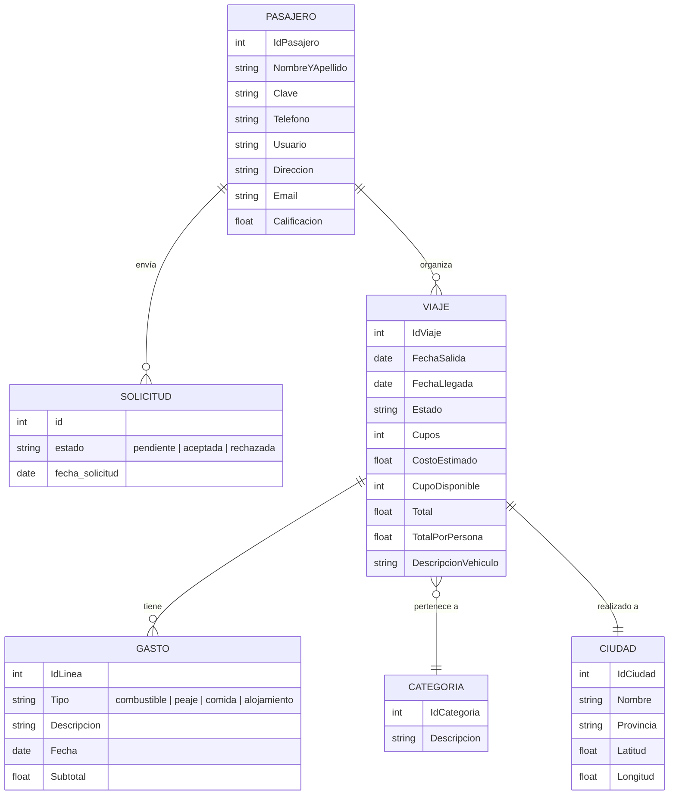

# Diagrama Entidad–Relación: Sistema de Viajes Compartidos

> El viaje incluye todo junto: viaje, alojamiento y comida compartidos.

```mermaid
erDiagram
    SOLICITUD {
        int id
        string estado "pendiente | aceptada | rechazada"
        date fecha_solicitud
    }

    PASAJERO {
        int IdPasajero
        string NombreYApellido
        string Clave
        string Telefono
        string Usuario
        string Direccion
        string Email
        float Calificacion
    }

    VIAJE {
        int IdViaje
        date FechaSalida
        date FechaLlegada
        string Estado
        int Cupos
        float CostoEstimado
        int CupoDisponible
        float Total
        float TotalPorPersona
        string DescripcionVehiculo
    }

    CATEGORIA {
        int IdCategoria
        string Descripcion
    }

    GASTO {
        int IdLinea
        string Tipo "combustible | peaje | comida | alojamiento"
        string Descripcion
        date Fecha
        float Subtotal
    }

    CIUDAD {
        int IdCiudad
        string Nombre
        string Provincia
        float Latitud
        float Longitud
    }

    PASAJERO ||--o{ VIAJE : "organiza"
    VIAJE ||--o{ GASTO : "tiene"
    VIAJE }o--|| CATEGORIA : "pertenece a"
    VIAJE ||--|| CIUDAD : "realizado a"
    PASAJERO ||--o{ SOLICITUD : "envía"

    %% Fórmulas explicativas
    %% /Calificacion = sumatoria de notas / total de notas
    %% /CupoDisponible = cupos - pasajerosAsociados
    %% /Total = sumatoria de subtotales
    %% /TotalPorPersona = Total / pasajerosAsociados con solicitud aceptada
```
